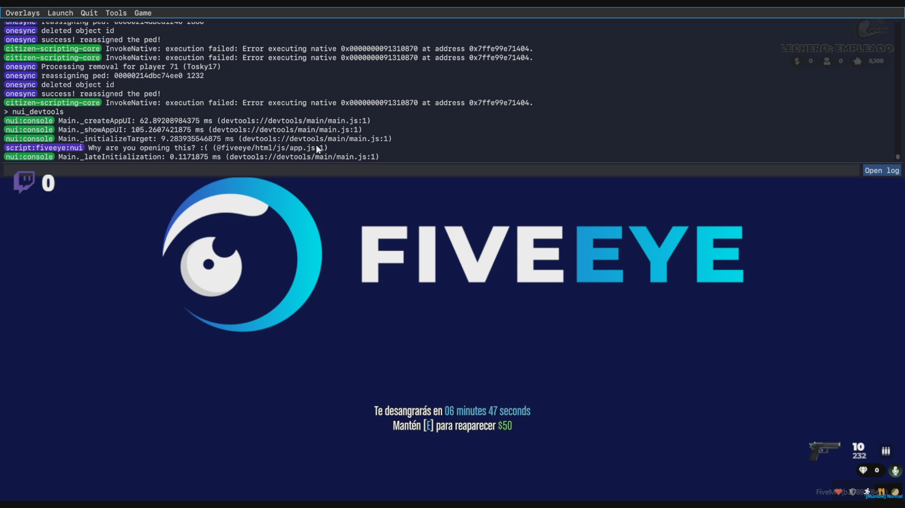

Disclaimer: All tests have been made in my own server.

In order to bypass some anticheats, it is possible to run JS with this tool without opening devtools.
The use of this script can be harmful to servers as there's a lot of ways to do XSS in Fivem which allows to gain admin perms and in some cases being able to execute LUA code in server side (WHICH IS SUPER INSECURE!).

https://github.com/user-attachments/assets/3b06fb8e-ace0-45a9-916e-fee45bc4516f

 
Here's a picture where I opened nui_devtools and got detected by anticheat.

 

Here's an example which uses the ressource "runcode" to execute lua server side and read ressources and receiving the information with a discord webhook

https://github.com/user-attachments/assets/f6d0100a-936b-408c-9a03-0d2d702409ef

